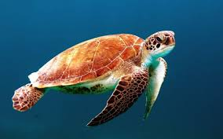

<!DOCTYPE html>
<html lang="de">
<head>
    <meta charset="UTF-8">
    <meta name="viewport" content="width=device-width, initial-scale=1.0">
    <title>Meeresschildkröten und Klimawandel</title>
    
</head>
<body>
    <header>
        <h1>Meeresschildkröten und der Klimawandel</h1>
        
Wie die Erderwärmung das Leben dieser urzeitlichen Meeresbewohner bedroht

    </header>

    <nav>
        <a href="#lebensweise">Lebensweise</a>
        <a href="#klimawandel">Klimawandel</a>
        <a href="#hilfe">Was können wir tun?</a>
    </nav>

    <section id="lebensweise" class="intro">
        <h2>Lebensweise der Meeresschildkröten</h2>
        
Meeresschildkröten sind faszinierende Meeresbewohner mit einer langen Evolutionsgeschichte. Sie leben in tropischen und subtropischen Meeren und kommen an Strände, um ihre Eier abzulegen.

        <h3>Merkmale und Lebensweise:</h3>
        <ul>
            <li><strong>Arten:</strong> Sieben Arten, z. B. Suppenschildkröte, Lederschildkröte</li>
            <li><strong>Lebensraum:</strong> Tropische und subtropische Meere, Strände zur Eiablage</li>
            <li><strong>Merkmale:</strong> Stromlinienförmiger Panzer, paddelförmige Flossen</li>
            <li><strong>Ernährung:</strong> Algen, Quallen, Krebstiere (je nach Art)</li>
            <li><strong>Gefährdung:</strong> Bedroht (Fischerei, Verschmutzung, Lebensraumverlust)</li>
        </ul>
        
    </section>

    <section id="klimawandel">
        <h2>Klimawandel und seine Auswirkungen</h2>
        
Der Klimawandel hat schwerwiegende Auswirkungen auf Meeresschildkröten. Steigende Meerestemperaturen und der Anstieg des Meeresspiegels zerstören Niststrände. Zudem beeinflusst die Erwärmung des Sandes das Geschlechterverhältnis der Jungtiere (mehr Weibchen), was die Population gefährdet.

    </section>

    <section id="hilfe" class="content">
        <h2>Was können wir tun?</h2>
        
Jeder kann dazu beitragen, den Klimawandel zu bekämpfen: durch Energieeinsparung, Nutzung erneuerbarer Energien und Unterstützung von Naturschutzorganisationen, die sich für den Erhalt der Lebensräume von Meeresschildkröten einsetzen.

    </section>

    <footer>
        
&copy; 2024 - Bewusst leben für die Natur

    </footer>
</body>
</html>
